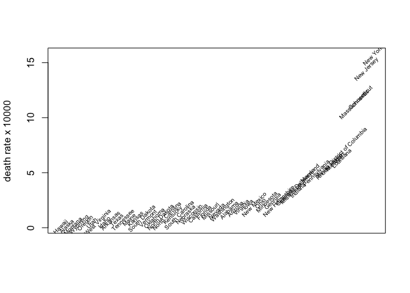
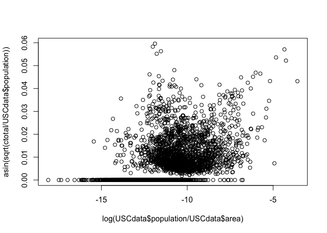
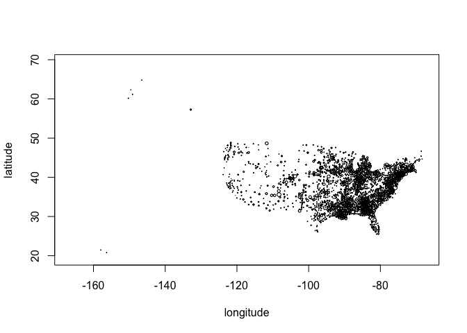
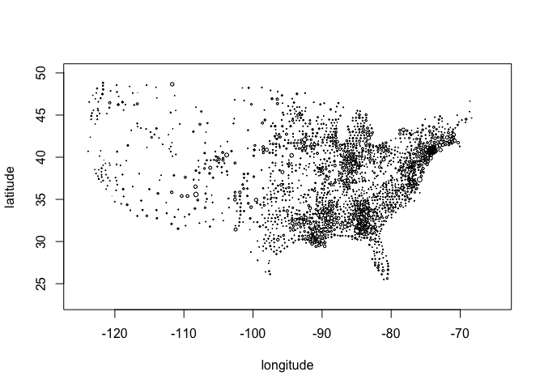
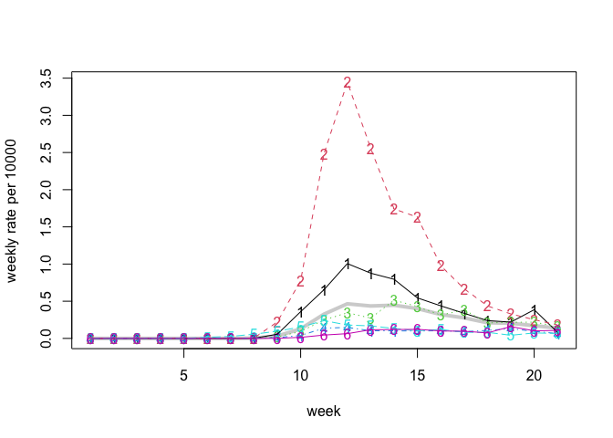

COVID-19 data
================
Peter Hoff
June 17, 2020

The file `UScountiesC19Data.r` reformats the [USA
Facts](https://usafacts.org/visualizations/coronavirus-covid-19-spread-map/)
COVID datasets. Specifically, this code creates county-specific weekly
time-series of new cases and new deaths. The files created by this code
include weekly case and death counts by US county (indexed by FIPS code)
in `.rds` and `.csv` formats.

I’ve put together some related county-level data that might be useful
for analyzing these COVID data, available at
<https://github.com/pdhoff/US-counties-data>. These other data include
county-level information on population, latitude and longitude,
geographic area, demographics, etc.

Comments:

  - Some of the cumulative totals were non-monotonic. I have monotonized
    them.

  - The USA Facts database includes an entry for “New York City
    Unallocated/Probable”. I have given this a FIPS code of 36000 (36 is
    the FIPS code of New York State). Similarly, data from the Grand
    Princess Cruise Ship is allocated to California, and given the FIPS
    code 06000 (06 is the FIPS code of California).

  - I suspect the `case` data are more a reflection of the number of
    tests being done than the number of people in the population who
    have the disease. The number of cases is a nondecreasing function of
    the number of tests, and reasons for and rates of testing may vary
    greatly by county. If someone has some data on the number of
    positive tests among a random sample from any population, please let
    me know.

-----

What follows below are a few descriptive plots of the data.

-----

You can create the data locally by sourcing `UScountiesC19Data.r`. Once
you’ve done this, you can load the data as follows:

``` r
## - county death counts
CCdata<-readRDS("UScountiesC19Deaths.rds") 
```

If you haven’t created or downloaded this file locally, you can load it
into your R session directly from the web as follows:

``` r
CCdata<-readRDS(url("https://github.com/pdhoff/US-counties-C19-data/blob/master/UScountiesC19Deaths.rds?raw=true"))   
```

Merge with county information:

``` r
## - US counties information 
USCdata<-readRDS(url("https://github.com/pdhoff/US-counties-data/blob/master/UScounties.rds?raw=true"))  

CCdata<-CCdata[ match(  USCdata$fips , rownames(CCdata)) ,] 

## check 

all( rownames(CCdata) == USCdata$fips )
```

    ## [1] TRUE

Note that we’ve just removed any data that were not allocated to a
specific county. This includes some data from NYC, and some data from
the Grand Princess Cruise Ship that was allocated to CA but not to a
county.

Compute state specific death rates:

``` r
## - county totals 
ctotal<-apply(CCdata,1,sum)

## - state totals and rate
stotal<-tapply(ctotal,USCdata$state,sum)
spop<-tapply(USCdata$pop,USCdata$state,sum) 
srate<-stotal/spop 
  
plot(sort(srate*10000),type="n",xaxt="n",xlab="",ylab="death rate x 10000")
text(rank(srate*10000),srate*10000,names(srate),srt=45,cex=.6) 
```

<!-- -->

``` r
## - rates versus population density 
plot( log(USCdata$population/USCdata$area), asin(sqrt(ctotal/USCdata$population )))
```

<!-- -->

Let’s use some geographic information:

``` r
crate<-ctotal/USCdata$population 

plot(USCdata$longitude,USCdata$latitude, cex=sqrt(crate/max(crate)),
     xlab="longitude",ylab="latitude")
```

<!-- -->

``` r
## - Lower 48 only
plot(USCdata$longitude,USCdata$latitude, cex=sqrt(crate/max(crate)),
     xlim=c(-125,-65),ylim=c(23,50), xlab="longitude",ylab="latitude")
```

<!-- -->

Here is a function that will compute the weekly state-level rates, and
plot them if requested:

``` r
## - function to compute and plot rates in each state 
stateRates<-function(state,plot=FALSE){
  idxState<-which(USCdata$"state"==state)
  yc<-CCdata[ idxState,,drop=FALSE]
  ps<-USCdata$pop[ idxState ]
  xy<-USCdata[ idxState, c("longitude","latitude") ]
  rc<-yc/ps

  if(plot){
    par(mfrow=c(1,2),mar=c(3,3,1,1),mgp=c(1.75,.75,0))
    mslope<-rc[,tail(1:ncol(rc),4) ]%*%poly(1:4,1)
    plot(xy,col="gray",xlab="",ylab="",xaxt="n",yaxt="n")
    points(xy[mslope<0,],col="green")
    points(xy[mslope>0,],col="red")
    plot( 10000*apply(yc,2,sum)/sum(ps),xlab="week",ylab="rate x 10000")
  }

  10000*apply(yc,2,sum)/sum(ps)
}
```

Now use the function to compute the death rate time series for each
state:

``` r
SRates<-NULL
for(st in sort(unique(USCdata$state)) ){
  SRates<-rbind(SRates, stateRates(st) )
}
rownames(SRates)<- sort(unique(USCdata$state))
```

Now we will plot the rates for some states that I’ve lived in, along
with the overall US rate:

``` r
UST<-10000*apply(CCdata,2,sum)/sum(USCdata$pop)

states<-c("Michigan","New York","Indiana","Wisconsin","Washington","North Carolina")
plot(UST,type="l",lwd=4,col="lightgray",ylim=range(SRates[states,]),ylab="weekly rate per 10000",xlab="week")
matplot(t(SRates[states,] ),add=TRUE)
matplot(t(SRates[states,] ),type="l",add=TRUE )
```

<!-- -->
