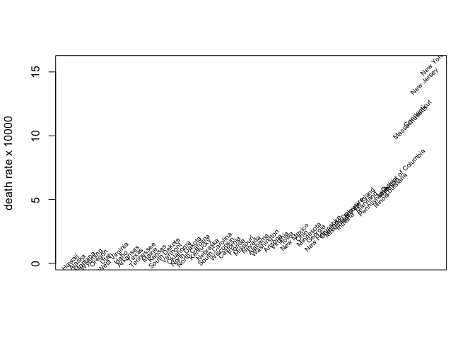
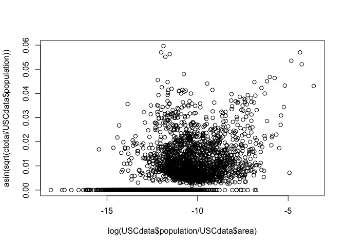
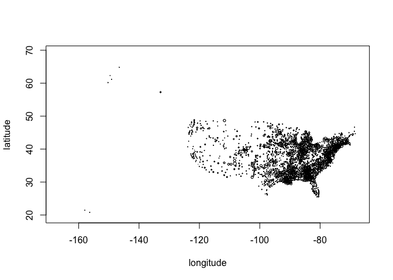
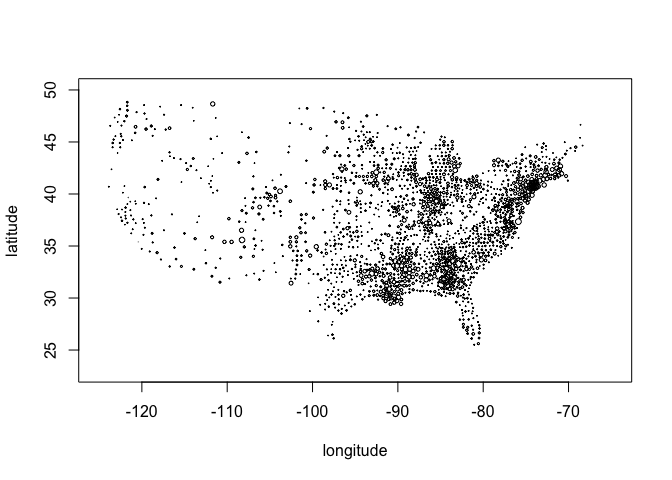
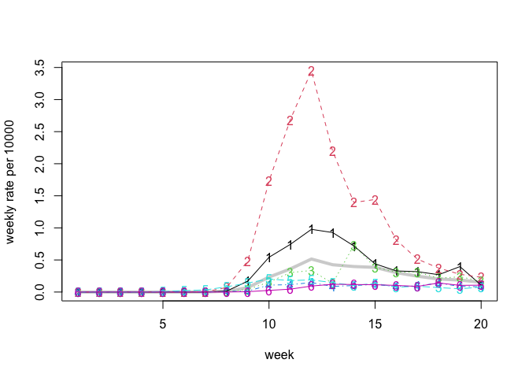

C19 data demo
================
Peter Hoff
June 17, 2020

Load data:

``` r
## - county death counts
CCdata<-readRDS(url("https://github.com/pdhoff/US-counties-C19-data/blob/master/UScountiesC19Deaths.rds?raw=true")) 

## - US counties information 
USCdata<-readRDS(url("https://github.com/pdhoff/US-counties-data/blob/master/UScounties.rds?raw=true"))
```

Compute state specific death rates:

``` r
## - county totals 
ctotal<-apply(CCdata,1,sum)

## - state totals and rate
stotal<-tapply(ctotal,USCdata$state,sum)
spop<-tapply(USCdata$pop,USCdata$state,sum) 
srate<-stotal/spop 
  
plot(sort(srate*10000),type="n",xaxt="n",xlab="",ylab="death rate x 10000")
text(rank(srate*10000),srate*10000,names(srate),srt=45,cex=.6) 
```

<!-- -->

``` r
## - rates versus population density 
plot( log(USCdata$population/USCdata$area), asin(sqrt(ctotal/USCdata$population )))
```

<!-- -->

Let’s use some geographic information:

``` r
crate<-ctotal/USCdata$population 

plot(USCdata$longitude,USCdata$latitude, cex=sqrt(crate/max(crate)),
     xlab="longitude",ylab="latitude")
```

<!-- -->

``` r
## - Lower 48 only
plot(USCdata$longitude,USCdata$latitude, cex=sqrt(crate/max(crate)),
     xlim=c(-125,-65),ylim=c(23,50), xlab="longitude",ylab="latitude")
```

<!-- -->

Here is a function that will compute the weekly state-level rates, and
plot them if requested:

``` r
## - function to compute and plot rates in each state 
stateRates<-function(state,plot=FALSE){
  idxState<-which(USCdata$"state"==state)
  yc<-CCdata[ idxState,,drop=FALSE]
  ps<-USCdata$pop[ idxState ]
  xy<-USCdata[ idxState, c("longitude","latitude") ]
  rc<-yc/ps

  if(plot){
    par(mfrow=c(1,2),mar=c(3,3,1,1),mgp=c(1.75,.75,0))
    mslope<-rc[,tail(1:ncol(rc),4) ]%*%poly(1:4,1)
    plot(xy,col="gray",xlab="",ylab="",xaxt="n",yaxt="n")
    points(xy[mslope<0,],col="green")
    points(xy[mslope>0,],col="red")
    plot( 10000*apply(yc,2,sum)/sum(ps),xlab="week",ylab="rate x 10000")
  }

  10000*apply(yc,2,sum)/sum(ps)
}
```

Now use the function to compute the death rate time series for each
state:

``` r
SRates<-NULL
for(st in sort(unique(USCdata$state)) ){
  SRates<-rbind(SRates, stateRates(st) )
}
rownames(SRates)<- sort(unique(USCdata$state))
```

Now we will plot the rates for some states that I’ve lived in, along
with the overall US rate:

``` r
UST<-10000*apply(CCdata,2,sum)/sum(USCdata$pop)

states<-c("Michigan","New York","Indiana","Wisconsin","Washington","North Carolina")
plot(UST,type="l",lwd=4,col="lightgray",ylim=range(SRates[states,]),ylab="weekly rate per 10000",xlab="week")
matplot(t(SRates[states,] ),add=TRUE)
matplot(t(SRates[states,] ),type="l",add=TRUE )
```

<!-- -->
