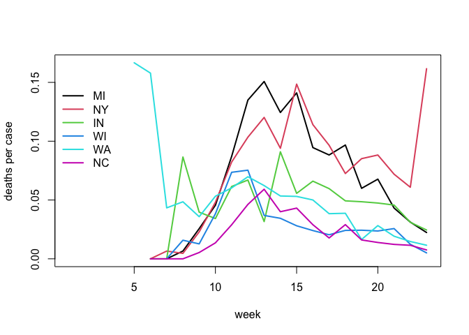

US COVID-19 summary statistics
================
Peter Hoff
30 June, 2020

Get data:

``` r
source("USC19data.r") 

C19data<-pullC19data()
```

Data for Durham County, NC:

``` r
dnc<-C19data["37063",,] 
tail(dnc) 
```

    ##            deaths cases
    ## 2020-06-24      0    75
    ## 2020-06-25      0     0
    ## 2020-06-26      0   132
    ## 2020-06-27      1    70
    ## 2020-06-28      0    50
    ## 2020-06-29      0    53

Get weekly totals for each state:

``` r
Y<-weekify(stateify(C19data)) 
dim(Y) 
```

    ## [1] 51 22  2

Deaths per cases plot for some states I’ve lived in:

``` r
phstates<-c("MI","NY","IN","WI","WA","NC") 

matplot( t(Y[phstates,,1]/Y[phstates,,2]), 
         type="l",lty=1,lwd=2,ylab="deaths per case",xlab="week")

legend(0,.15,lwd=2,col=1:length(phstates),legend=phstates,bty="n") 
```

<!-- -->
