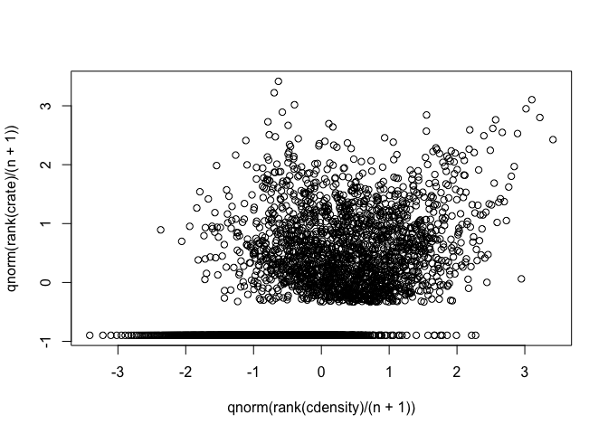
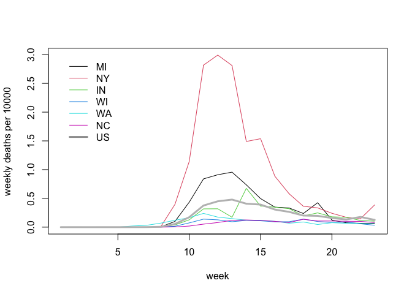

US COVID-19 county and state rates per population
================
Peter Hoff
30 June, 2020

Get data:

``` r
source("USC19data.r")

C19data<-pullC19data() 

dim(C19data) 
```

    ## [1] 3195  160    2

Merge with county information:

``` r
## - US counties information 
USCdata<-readRDS(url("https://github.com/pdhoff/US-counties-data/blob/master/UScounties.rds?raw=true"))  

C19data<-C19data[ match(USCdata$fips,dimnames(C19data)[[1]]),, ] 

dim(C19data)
```

    ## [1] 3141  160    2

Relationship between county death rates and county population density:

``` r
## - county totals 
ctotal<-apply(C19data[,,1],1,sum)

## county rates 
crate<-ctotal/USCdata$population 

## - county pop density 
cdensity<-USCdata$population/USCdata$area 

n<-length(ctotal) 

plot( qnorm(rank(cdensity)/(n+1)), qnorm(rank(crate)/(n+1)) )
```

<!-- -->

State-level death rates:

``` r
## - state totals and rate
stotal<-tapply(ctotal,USCdata$state,sum)
spop<-tapply(USCdata$pop,USCdata$state,sum) 
srate<-stotal/spop 
  
plot(sort(srate*10000),type="n",xaxt="n",xlab="",ylab="deaths per 10000")
text(rank(srate*10000),srate*10000,names(srate),srt=45,cex=.6) 
```

<!-- -->

Let’s use some geographic information:

``` r
## - Lower 48 only
plot(USCdata$longitude,USCdata$latitude, cex=sqrt(crate/max(crate)),
     xlim=c(-125,-65),ylim=c(23,50), xlab="longitude",ylab="latitude")
```

<!-- -->

Weekly state level counts and rates:

``` r
X<-weekify(stateify(C19data)) 

statePops<-tapply(USCdata$pop,USCdata$state,sum) 

R<-sweep(X,1,statePops,"/") 

matplot(t(R[,,1]),type="l")
```

<!-- -->

Now plot the rates for some states that I’ve lived in, along with the
overall US rate:

``` r
## -- some states
phstates<-c("MI","NY","IN","WI","WA","NC")
matplot(10000*t(R[phstates,,1]),ylab="weekly deaths per 10000",xlab="week",lty=1,type="l")  

## -- US rates 
ustotal<-apply(X[,,1],2,sum )
usrate<-ustotal/sum(statePops) 
lines(10000*usrate,col="gray",lwd=3)  

legend(1,3,legend=c(phstates,"US"),col=c(1:length(phstates),8), 
      lty=1,lwd=c(rep(1,length(phstates)),3),bty="n")
```

<!-- -->
