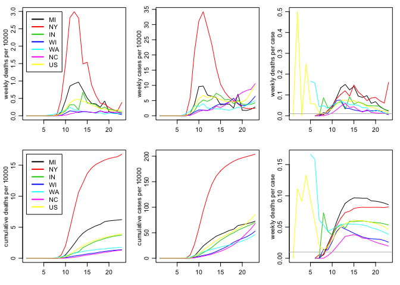

US COVID-19 rates - US and state summaries
================
Peter Hoff
06 July, 2020

Get C19 data:

``` r
source("USC19data.r")
Cdata<-pullC19data() 
dcounts<-stateify(Cdata,UStotal=TRUE) 
wcounts<-weekify(dcounts) 
```

Get population data:

``` r
USCdata<-readRDS(url("https://github.com/pdhoff/US-counties-data/blob/master/UScounties.rds?raw=true"))  
spop<-tapply(USCdata$pop,USCdata$state,sum)
spop<-c(spop,sum(spop))
names(spop)[length(spop)]<-"US" 
```

Plot weekly rates (per 10000) for US and various states:

``` r
wrates<-10000*sweep(wcounts,1,spop,"/")

states<-c("MI","NY","IN","WI","WA","NC","US") 

par(mfrow=c(2,3),mar=c(3,3,1,1),mgp=c(1.75,.75,0))

#### incedental
matplot(t(wrates[states,,1]),type="l",lty=1,col=1:length(states),ylab="weekly deaths per 10000") 
legend(1,max( wrates[states,,1]),legend=states,col=1:length(states),lwd=2) 

matplot(t(wrates[states,,2]),type="l",lty=1,ylab="weekly cases per 10000",col=1:length(states)) 

matplot(t(wrates[states,,1]/wrates[states,,2]),type="l",lty=1,ylab="weekly deaths per case",col=1:length(states)) 
abline(h=.01,col="gray") 


#### cumulative 
cwrates<-aperm(apply(wrates,c(1,3),cumsum),c(2,1,3) )

matplot(t(cwrates[states,,1]),type="l",lty=1,col=1:length(states),ylab="cumulative deaths per 10000")
legend(1,max( cwrates[states,,1]),legend=states,col=1:length(states),lwd=2) 

matplot(t(cwrates[states,,2]),type="l",lty=1,ylab="cumulative cases per 10000",col=1:length(states))

matplot(t(cwrates[states,,1]/cwrates[states,,2]),type="l",lty=1,ylab="weekly deaths per case",col=1:length(states))  
abline(h=.01,col="gray") 
```

<!-- -->
